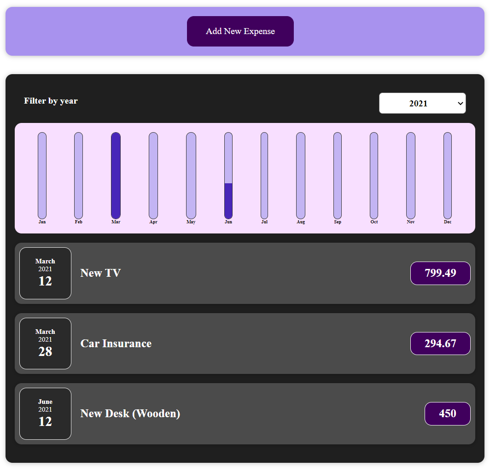
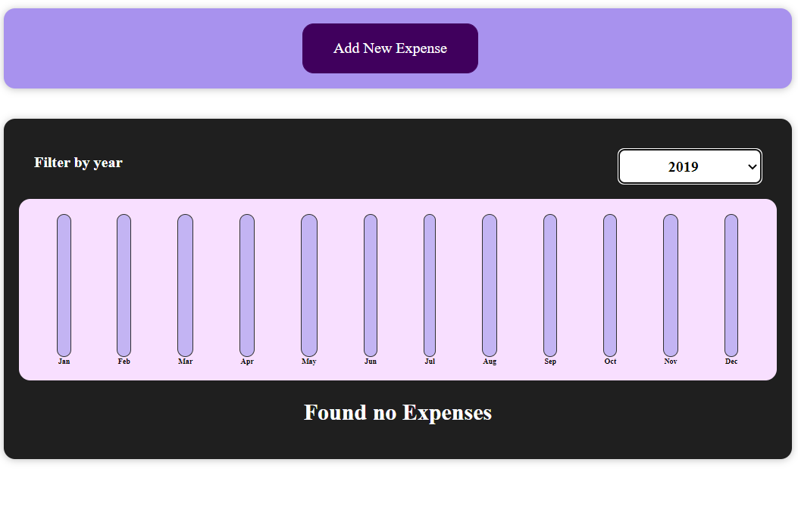
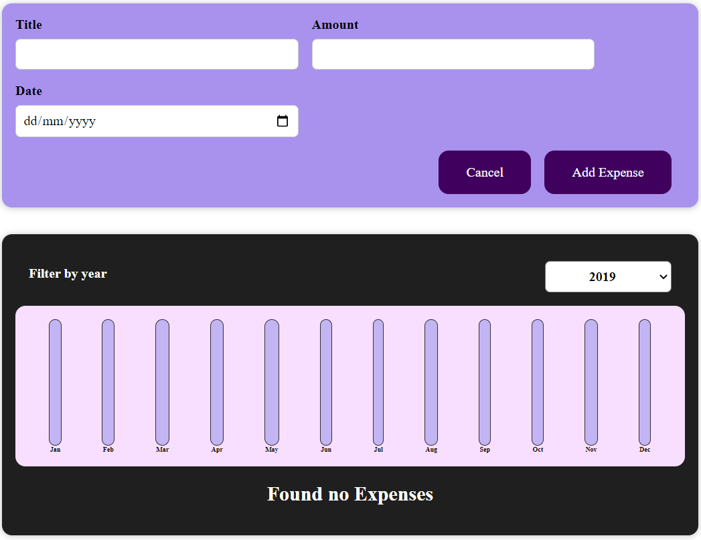

# Expense tracker APP

#### Expense Tracker App build using React Framework

***
When 2021 is selected only the expense added for that year are shown

***
In 2019 no expenses were added to the tracker therefore the renderes a message saying 'Found no Expenses'

***
When 'Add New Expense' clicked, option to add a new expense is shown

